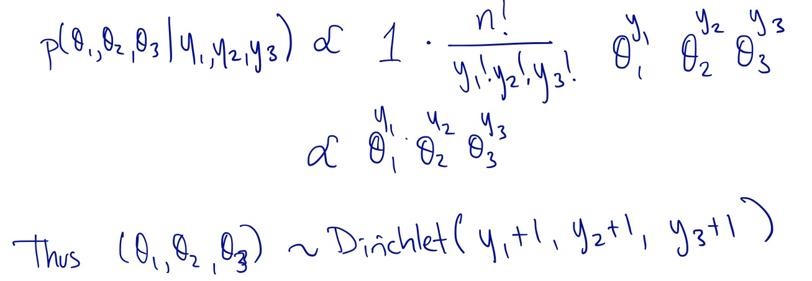
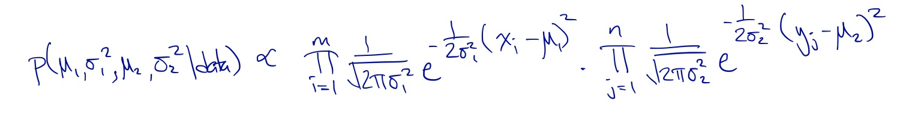
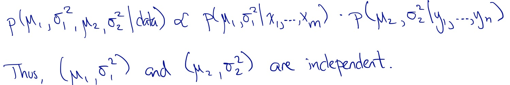

```{r setup, include=FALSE}
knitr::opts_chunk$set(message = FALSE, eval = TRUE)
set.seed(1633316812) # as.integer(Sys.time())

library(tidyverse)
library(knitr)
```

\pagenumbering{gobble} 

# Comparing groups -- Solution
## Stat 340, Fall 2021


### Example 1. Comparing proportions across 3+ groups

SurveyUSA conducted a poll from October 29 to 31, 2020. A total of 1,500 registered voters were polled and asked to indicate their preference in the presidential election. $y_1 = 743$ supported Biden, $y_2 = 607$ supported Trump, and $y_3 = 150$ supported other candidates, expressed no opinion, or were unsure. 

The counts an be modeled as arising from a multinomial distribution with sample size $n=1500$ and respective probabilities $\theta_1$, $\theta_2$, and $\theta_3$.

For this example, use a uniform (uninformative) prior on ($\theta_1$, $\theta_2$, $\theta_3$); that is,

$$\pi(\theta_1, \theta_2, \theta_3) \propto 1.$$

(a) Show that the joint posterior distribution of $(\theta_1, \theta_2, \theta_3)$ is a Dirichlet distribution of the form:

$$f(\theta_1, \ldots, \theta_k | a_1, \ldots, a_k) = 
\frac{\Gamma(\alpha_1 + \ldots + \alpha_k)}{\Gamma(\alpha_1) \cdots \Gamma(\alpha_k)} \theta_1^{\alpha_1} \cdots \theta_k^{\alpha_k}, \ \theta_1 \in [0,1], \ldots, \theta_k \in [0,1],\ \sum_{j=1}^k \theta_j = 1.$$

```{r echo=FALSE, out.width="0.8\\textwidth"}

```


(b) You can use the `rdirichlet()` function in the **LearnBayes** R package (which is loaded by **ProbBayes**) to simulate from your posterior from part (a). To do this, store the parameters from your posterior in the vector `alpha`, then draw 1000 simulations from the posterior.

```{r}
# Fill in the blanks with the posterior parameter values
alpha <- c(743 + 1, 607 + 1, 150 + 1) 

# Draw samples from the posterior
library(LearnBayes)
theta <- rdirichlet(1000, alpha)
```

(c) Using your posterior draws, find the posterior density of $\theta_1 - \theta_2$, the difference in proportions between Biden and Trump. Create a histogram of this posterior.

```{r, fig.align="center", fig.width = 3.5, fig.height = 3}
ggplot(data.frame(diff = theta[,1] - theta[,2])) +
    geom_histogram(aes(x = diff)) +
    labs(x = expression(theta[1] - theta[2]), y = "Frequency")
```


(d) What is the posterior probability that a larger proportion of registered voters support Biden?
    
    ```{r}
mean(theta[,1] - theta[,2] > 0)
```


### Example 2. A Bayesian two-sample t-test

Suppose that we observe two independent normal samples, the first distributed according to an $\mathcal{N}(\mu_1 , \sigma_1)$ distribution, the second according to an $\mathcal{N}(\mu_2 , \sigma_2)$ distribution. Denote the first sample by $X_1,\ldots,X_m$ and the second sample by $Y_1, \ldots, Y_n$. Suppose also that the parameters $(\mu_1 , \sigma_1^2, \mu_2 , \sigma_2^2)$ are assigned the vague prior

$$\pi(\mu_1 , \sigma_1^2, \mu_2 , \sigma_2^2) \propto \frac{1}{\sigma_1^2\sigma_2^2}.$$

(a) Write down an expression for the posterior density.

    ```{r echo=FALSE, out.width="0.8\\textwidth"}

```


(b) Show that the vectors $(\mu_1 , \sigma_1^2)$ and $(\mu_2 , \sigma_2^2)$ are independent. To do this, show that the posterior distribution derived in (a) can be factored into the product of two posteriors, where these posteriors are *similar* to posterior we derived during class *last time* for the one group problem.

    ```{r echo=FALSE, out.width="0.8\\textwidth"}

```

\clearpage

(c) Keeping in mind that $(\mu_1 , \sigma_1^2)$ and $(\mu_2 , \sigma_2^2)$ are independent, describe how to simulate from the joint posterior density of $(\mu_1 , \sigma_1^2, \mu_2 , \sigma_2^2)$. (Do this in words or using psuedo code. Hint - you can apply the grid approximation approach twice.)

To sample from the posterior of $(\mu_1 , \sigma_1^2)$ you can:

1. Define the grid for $\mu_1$ and the grid for $\sigma_1^2$. (You need to decide how many points to use and then you make a list of the parameter values on the grid.)
2. Compute the value of the prior at each parameter value on the grid.
3. Compute the likelihood at each parameter value.
4. Compute the unstandardized posterior at each parameter value, by multiplying the prior by the likelihood.
5. standardize the posterior, by dividing each value by the sum of all values.
6. Draw a sample of $S$ $(\mu_1^{(i)} , \sigma_1^{2(i)})$ pairs.

You can use this same process to sample from the posterior of $(\mu_2 , \sigma_2^2)$.

(d) The following data give the mandible lengths in millimeters for 10 male and ten female golden jackals in the collection of the British Museum. Using simulation procedure you outlined in part (c), find the posterior density of the difference in mean mandible length between the sexes. Is there sufficient evidence to conclude that the males have a larger average?

Hints/notes:

- For the prior distribution, plug in the the sample variances in place of $\sigma_1^2$ and $\sigma_2^2$.

- A workable grid for $\mu_1$ and $\mu_2$ is in the interval (100, 140).

- A workable grid for $\sigma_1$ and $\mu_2$ is in the interval (1, 15).

    ```{r}
males   <- c(120, 107, 110, 116, 114, 111, 113, 117, 114, 112)
females <- c(110, 111, 107, 108, 110, 105, 107, 106, 111, 111)

# Calculating summary statistics
avg_male <- mean(males)
avg_female <- mean(females)

var_male <- var(males)
var_female <- var(females)

m <- length(males)
n <- length(females)
```

First, let's approximate the joint posterior for $(\mu_1 , \sigma_1^2)$:

```{r}
# Create a grid over the coordinate plane
param_grid1 <- expand.grid(
  mu1 = seq(from = 100, to = 140, length.out = 1000), 
  sigma1 = seq(from = 1, to = 15, length.out = 1000)
)


# log likelihood function
log_lik_norm <- function(x, mu, sigma) {
  sum(dnorm(x, mean = mu, sd = sigma, log = TRUE))
}

# Vectorize so we can pass in all mu and sigma at once
log_lik_norm <- Vectorize(log_lik_norm, vectorize.args = c("mu", "sigma"))

# Calculate the unstandardized posterior, then standardize
posterior1 <- param_grid1 %>%
  mutate(
    log_prior = -log(var_male),
    log_lik = log_lik_norm(males, mu = mu1, sigma = sigma1), 
    log_post = log_prior + log_lik,
    unstd_post = exp(log_post - max(log_post)),
    post = unstd_post / sum(unstd_post)
  )
```

I use a heatmap to check that I have the posterior density covered by the grid (via some trial and error):

```{r out.width="0.7\\textwidth"}
ggplot(posterior1, aes(x = mu1, y = sigma1, fill = post)) +
    geom_tile() +
    scale_fill_gradient(low = "white", high = "black")
```


Now, let's approximate the joint posterior for $(\mu_2 , \sigma_2^2)$:

```{r}
# Create a grid over the coordinate plane
param_grid2 <- expand.grid(
  mu2 = seq(from = 100, to = 140, length.out = 1000), 
  sigma2 = seq(from = 1, to = 15, length.out = 1000)
)


# log likelihood function
log_lik_norm <- function(x, mu, sigma) {
  sum(dnorm(x, mean = mu, sd = sigma, log = TRUE))
}

# Vectorize so we can pass in all mu and sigma at once
log_lik_norm <- Vectorize(log_lik_norm, vectorize.args = c("mu", "sigma"))

# Calculate the unstandardized posterior, then standardize
posterior2 <- param_grid2 %>%
  mutate(
    log_prior = -log(var_female),
    log_lik = log_lik_norm(females, mu = mu2, sigma = sigma2), 
    log_post = log_prior + log_lik,
    unstd_post = exp(log_post - max(log_post)),
    post = unstd_post / sum(unstd_post)
  )
```

Again, let's check the heatmap of the posterior density


```{r out.width="0.7\\textwidth"}
ggplot(posterior2, aes(x = mu2, y = sigma2, fill = post)) +
    geom_tile() +
    scale_fill_gradient(low = "white", high = "black")
```


Now that you have approximated the two posteriors, you can sample $S=1000$ draws from each.

```{r}
S <- 1000
posterior_draws_male <- sample_n(
    posterior1, 
    size = S, 
    replace = TRUE, 
    weight = post
) %>%
    select(mu1, sigma1)

posterior_draws_female <- sample_n(
    posterior2, 
    size = S, 
    replace = TRUE, 
    weight = post
) %>%
    select(mu2, sigma2)
```


Now, to answer our question, we calculate $\mu_1 - \mu_2$ for the $S$ draws and estimate the posterior probability from this posterior distribution of the difference:

```{r}
post_diff <- posterior_draws_male$mu1 - posterior_draws_female$mu2

mean(post_diff > 0)
```

