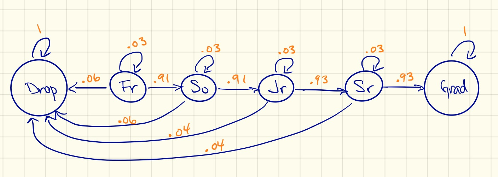
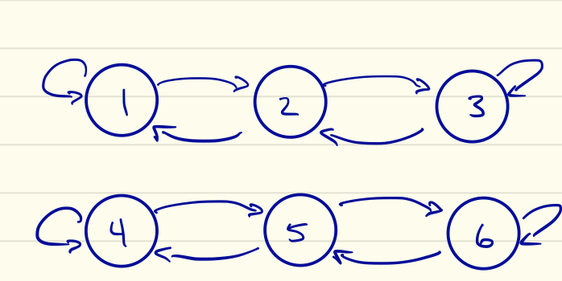
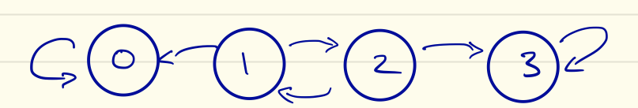
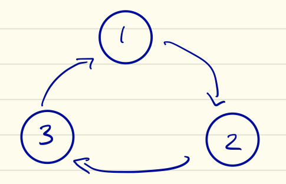

```{r setup, include=FALSE}
options(htmltools.dir.version = FALSE)
knitr::opts_chunk$set(dev = 'svg')
library(gridExtra)
library(ggplot2)
library(ggthemes)
library(LearnBayes)
```

class: middle, clear

class: title-slide, left, middle


# `r rmarkdown::metadata$title`

### `r rmarkdown::metadata$author`

---
class: inverse


## Your turn

```{r echo=FALSE, out.width="75%", fig.align='center'}

```

1. What's the probability that a student who drops out will re-enroll?

1. What's the probability that a senior will graduate?

1. Does that probability depend on how many years it took them to achieve senior class standing?


---
class: middle

# Concepts

## 1. Markov chains

## 2. Transition matrices

---
class: inverse

## Your turn

```{r echo=FALSE, out.width="70%", fig.align='center'}

```

.Large[
Write down the $6 \times 6$ transition matrix for the university graduation rate Markov chain model.

1. Should the probabilities within each .bold[row] sum to 1?

1. Should the probabilities within each .bold[column] sum to 1?
]

---
class: middle

# Concepts

## 3. Calculating probabilities using the transition matrix

## 4. Marginal distribution of $\bf X_n$

---
class: inverse

## Your turn


Read over state/chain classifications and apply these labels to the following Markov chains:

.pull-left[

```{r echo=FALSE, out.width = "85%"}




```
]

.pull-right[
```{r echo=FALSE, out.width = "85%"}


```
]

---
class: middle

```{r echo=FALSE, fig.align='center'}

```

---
class: middle

```{r echo=FALSE, fig.align='center'}

```

---
class: middle

```{r echo=FALSE, fig.align='center'}

```

---
class: middle

```{r echo=FALSE, fig.align='center'}

```

---
class: middle

# Concepts

## 5. Long-run behavior

## 6. Ergodic Markov chains 