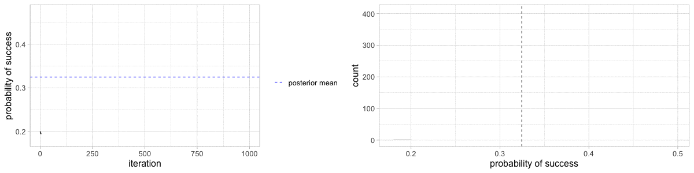

class: clear, middle

```{r setup, include=FALSE}
options(htmltools.dir.version = FALSE)
knitr::opts_chunk$set(dev = 'svg')
library(gridExtra)
library(ggplot2)
library(ggthemes)
library(LearnBayes)
library(tidyverse)
library(xaringanExtra)
library(countdown)
library(knitr)
library(kableExtra)
xaringanExtra::use_tachyons()
xaringanExtra::use_freezeframe()


library(here)
votes <- read_csv(here("data", "pres_pct_change_2016_2020.csv"))

yt <- 0

bivariate <- tribble(
  ~"X=0", ~"Y=0", ~"1", ~"2", 
  0    , .025 , .015 , .01,
  1    , .050 , .03  , .02,
  2    , .125 , .075 , .050,
  3    , .150 , .090 , .060,
  4    , .100 , .060 , .040,
  5    , .050 , .030 , .020
) %>%
  as.data.frame()
```

class: middle, clear

class: title-slide, left, middle


# `r rmarkdown::metadata$title`

### `r rmarkdown::metadata$author`

---
class: middle 

## 1. Gibbs sampler

## 2. Convergence checks

## 3. Inference using MCMC draws

## (Problem topics 8, 10, 11)

---

## Metropolis algorithm


```{r echo=FALSE}

```


---
class: inverse

# Your turn

.Large[
Take a look at the four trace plots provided as an example. For each, determine

1. whether the chain converged

2. roughly how many iterations it took to converge
]

```{r echo=FALSE}
countdown(3)
```


---
background-image: url(figs/15-converge-longer.png)
background-position: right
background-size: 53%
class:inverse, middle

.left-narrow[
1. Did the chain converge?

2. If so, how many iterations did it take?
]

---
background-image: url(figs/15-converge-short.png)
background-position: right
background-size: 53%
class:inverse, middle

.left-narrow[
1. Did the chain converge?

2. If so, how many iterations did it take?
]


---
background-image: url(figs/15-no-converge.png)
background-position: right
background-size: 53%
class:inverse, middle

.left-narrow[
1. Did the chain converge?

2. If so, how many iterations did it take?
]

---
background-image: url(figs/15-questionable-converge.png)
background-position: right
background-size: 53%
class:inverse, middle

.left-narrow[
1. Did the chain converge?

2. If so, how many iterations did it take?
]

---
class: middle

# Simulating from a discrete bivariate distribution

---

## Example: Traffic

The joint PMF of the number of cars (X) and the number of buses (Y ) per signal cycle at a proposed left-turn lane is given below

.Large[
```{r results='asis', echo=FALSE}
kable(bivariate)
```

]

---

## Simulation process

.pull-left[

Condition on $Y=0$, simulate an X 

```{r echo=FALSE}
bivariate %>%
  kbl() %>%
  column_spec(2, background = "skyblue")
set.seed(1234)
```

.code90[
```{r}
sample(0:5, size = 1, prob = bivariate[[2]])
```
]


]

--

.pull-right[

Condition on $X=3$, simulate a Y 

```{r echo=FALSE}
bivariate %>%
  kbl() %>%
  row_spec(4, background = "skyblue")
```

.code80[
```{r}
sample(0:2, size = 1, prob = bivariate[4,2:4])
```
]

]

---
class: middle 

# Simulating from a bivariate continuous distribution


---

## Change in the democratic vote

- How did democratic share of the two party vote change from 2016 to 2020?

- MIT Election Data and Science Lab has county-level election results

- We'll look at the percent change in the two-party vote

    $$Y_i = 100\left(A_i / B_i - 1 \right)$$

  $A_i =$ % of two-party vote cast for democrats in 2020
    
  $B_i =$ % of two-party vote cast for democrats in 2016


.footnote[MIT Election Data and Science Lab, "County Presidential Election Returns 2000-2020", https://doi.org/10.7910/DVN/VOQCHQ, Harvard Dataverse, V9]

---

## Hypothetical sample

We'll work with a hypothetical sample of 100 counties

```{r echo=FALSE}
set.seed(23537095)
select_county <- votes %>% 
  drop_na(pct_change_dem) %>%
  sample_n(size = 100, replace = FALSE)
```

.pull-left[
```{r echo=FALSE, fig.height = 3, fig.width = 4.5, fig.align='center', out.width = "100%",  warning=FALSE}
ggplot(select_county, aes(x = pct_change_dem)) +
  geom_histogram(bins = 20, fill = "navy", alpha = 0.6) +
  labs(x = "% change in democratic vote")
```
]

.pull-right[
$\overline{y} = `r round(mean(select_county$pct_change_dem), 2)`$

$n = 100$
]

---

## Model

$Y_i = 100(A_i/B_i - 1)$, the percent change in support

.pull-left[
$$
\begin{align}
Y_i | \mu, \sigma &\overset{\rm iid}{\sim} \mathcal{N}(\mu, \sigma) & \qquad \qquad \qquad \qquad \qquad \qquad \qquad \qquad \phantom{text}\\
\mu & \sim \mathcal{N}(\mu_0, \sqrt{1/\phi_0}) &\\
\phi = 1/\sigma^2 & \sim {\rm Gamma}(a, b) &\\
\mu &\perp \phi
\end{align}
$$
]

--

.pull-right[

$$
\begin{align}
\mu_0 &= 0 & \qquad \qquad \qquad \qquad \qquad \qquad \phantom{text}\\
\phi_0 &= 1/1000 &\\
a &= 0.1 &\\
b &= 0.1 &\\
\end{align}
$$

These are very weak priors

]


---

## Prior predictive check
.left-wide[
```{r fig.width = 4, fig.height = 3.5, echo=FALSE, warning=FALSE, message=FALSE, out.width = "85%", fig.align='center'}
library(LearnBayes)
library(ggplot2)
mu0s   <- rnorm(1e4, 0, sqrt(1000))
sig20s <- rigamma(1e4, 0.1, 0.1)
y0s    <- rnorm(1e4, mu0s, sqrt(sig20s))

ggplot(data = NULL) +
  geom_histogram(aes(x = y0s)) +
  lims(x = c(-200, 200)) +
  theme_light() +
  labs(title = "Prior predictive distribution", x = "Pct change")
```
]


If you don't think the priors induce a reasonable distribution on $Y$, then tweak the parameters (e.g. inflate $\sigma_0$)


---

## Posterior


$$
\begin{align}
\pi(\mu, \phi | y_1, \ldots, y_n) &\propto \pi(\mu) \pi(\phi) \cdot \prod_{i=1}^n f(y_i | \mu, \sigma^2)\\
  &\propto \exp \left[ - \dfrac{\phi_0}{2} (\mu - \mu_0)^2 \right] \cdot \phi^{a-1} \exp\left[ -b\phi \right] \cdot \\
  &\quad  \prod_{i=1}^n \phi^{1/2} \exp\left[ - \dfrac{\phi}{2}(y_i - \mu)^2 \right]
\end{align}
$$

.bg-washed-blue.b--dark-blue.ba.bw2.br3.shadow-5.ph4.mt5[
How can we do this *efficiently* sample from this 2D posterior?
]

---

## Two-stage Gibbs sampler


.bold[Target:] samples from $\pi(\theta_1, \theta_2 |y_1, \ldots, y_n)$

.bold[Algorithm:] 

1. Set initial values for parameter values, $\boldsymbol{\theta}^{(0)} = \left(\theta^{(0)}_1, \theta^{(0)}_2 \right)$

2. Draw $\theta_1^{(1)}$ from $\pi(\theta_1 | \theta_2, y_1, \ldots, y_n)$ 

3. Draw $\theta_2^{(1)}$ from $\pi(\theta_2 | \theta_1, y_1, \ldots, y_n)$ 

4. Repeat steps 2-3 $S$ times

After convergence, draws $\left( \theta_1^{(k)}, \theta_2^{(k)} \right)$ are from the posterior distribution

---
background-image: url(figs/15-gibbs-anim.png)
background-size: cover

## [Animated Gibbs sampler](https://chi-feng.github.io/mcmc-demo/app.html?algorithm=GibbsSampling&target=standard)


---
class: inverse

# Your turn


In our example, $\boldsymbol{\theta} = (\mu, \sigma^2)$

Discuss with your neighbor .bolder[how] you would find the following conditional posterior distributions from the joint posterior:

1. $\pi(\mu | \phi, y_1, \ldots, y_n)$

1. $\pi(\phi | \mu, y_1, \ldots, y_n)$

```{r echo=FALSE}
countdown(2)
```


---

## Full conditional distributions


$$
\begin{align}
\pi(\phi | y_1, \ldots, y_n, \mu) & \propto \pi(\phi) f(y_1, \ldots, y_n | \phi, \mu)\\
& \propto \phi^{a-1} \exp\left[ -b\phi \right] \cdot \prod_{i=1}^n \phi^{1/2} \exp\left[ - \dfrac{\phi}{2}(y_i - \mu)^2 \right]\\
&= \phi^{a-1} \exp\left[ -b\phi \right] \cdot \phi^{n/2} \exp\left[ - \dfrac{\phi}{2} \sum_{i=1}^n (y_i - \mu)^2 \right]\\
&= \phi^{\left(n/2 + a \right) - 1} \exp\left[ -\phi \left\{ \frac{1}{2} \sum_{i=1}^n (y_i - \mu)^2 +b \right\} \right] 
\end{align}
$$

.large[
.bold[
Is this a distribution we have seen before?
]
]

---

## Full conditional distributions

.small[
$$
\begin{align}
\pi(\mu | \phi, y_1, \ldots, y_n) &\propto \pi(\mu)  \prod_{i=1}^n f(y_i | \mu, \sigma^2)\\
&\propto \exp \left[ - \dfrac{\phi_0}{2} (\mu - \mu_0)^2 \right]  \cdot 
  \prod_{i=1}^n \phi^{1/2} \exp\left[ - \dfrac{\phi}{2}(y_i - \mu)^2\right]\\
&= \exp \left[ - \dfrac{\phi_0}{2} (\mu - \mu_0)^2 \right]  \cdot \phi^{n/2} \exp \left[-\phi \left\{ \frac{1}{2} \sum_{i=1}^n (y_i - \mu)^2\right\}  \right]\\
&\propto \exp\left[ -\frac{\phi_0 + n\phi}{2} \left\{ \mu - \frac{\mu_0 \phi_0 + n \overline{y} \phi}{\phi_0 + n\phi} \right\}^2 \right]
\end{align}
$$
]

.bold[Is this a distribution we know?]

---

## Getting ready to sample

```{r}
# Data
y <- select_county$pct_change_dem
n <- length(y)

# Prior specification
mu0  <- 0
phi0 <- 1/1000
a    <- 0.1
b    <- 0.1

# Initial parameter values
mu <- mean(y)
s2 <- var(y)
phi <- 1 / s2


# Create empty S x p matrix for MCMC draws
S                    <- 5000
mcmc_draws           <- matrix(NA, nrow = S, ncol = 2)
colnames(mcmc_draws) <- c("mu", "phi")
```

---

## Gibbs sampler

```{r}
for(i in 1:S) {
  
  # sample from mu | s2, y
  A   <- sum(y) * phi + mu0 * phi0
  B   <- n * phi + 1 * phi0
  mu  <- rnorm(1, A/B, 1/sqrt(B))
  
  # sample from s2 | mu, y
  shape  <- n / 2 + a
  scale  <- (sum((y - mu)^2) / 2) + b
  phi    <- rgamma(1, shape, scale)
  
  # Store the draws
  mcmc_draws[i, ] <- c(mu, phi)
}
```

---


To get the joint posterior of interest, $\pi(\mu, \sigma | y_1, \ldots, y_n)$, transform $\phi$

.pull-left[
```{r echo=FALSE, fig.height = 4.5, fig.width = 4.5, out.width = "100%"}
mcmc_draws %>%
  as.data.frame() %>%
  ggplot(aes(x = mu, y = phi)) +
  geom_point(alpha = 0.2)  +
  ylab(expression(phi)) +
  xlab(expression(mu))
```
]

--


.pull-right[
```{r echo=FALSE, fig.height = 4.5, fig.width = 4.5, out.width = "100%"}
mcmc_draws %>%
  as.data.frame() %>%
  ggplot(aes(x = mu, y = sqrt(1/phi))) +
  geom_point(alpha = 0.2) +
  ylab(expression(sigma)) +
  xlab(expression(mu))
```
]


---

## Did the chain converge?

```{r fig.height = 3.5, fig.width = 7, echo=FALSE, out.width = "90%", fig.align='center'}
data.frame(x = 1:S, y = mcmc_draws[,"mu"]) %>%
  ggplot(aes(x, y)) +
  geom_line() +
  labs(x = "Interation", y = "MCMC sample", title = bquote("Traceplot: for " ~ mu))
```

Don't hesitate to snoop around with different `xlim`!

---

## Did the chain converge?

```{r fig.height = 3.5, fig.width = 7, echo=FALSE, out.width = "90%", fig.align='center'}
data.frame(x = 1:S, y = mcmc_draws[,"phi"]) %>%
  ggplot(aes(x, y)) +
  geom_line() +
  labs(x = "Interation", y = "MCMC sample", title = bquote("Traceplot: for " ~phi))
```


---

## Posterior analysis

.small[
Toss out samples prior to convergence (this is called the *burn in* period)

Draw inferences using the remaining MCMC samples just like we have all term
]
.code90[
```{r}
no_burn <- mcmc_draws[-c(1:100),]
```
]


.pull-left[
```{r echo=FALSE, fig.height = 3.5, fig.width = 3.5, out.width = "55%", fig.align='center'}
as.data.frame(no_burn) %>%
ggplot() +
  geom_point(aes(x = mu, y = phi), alpha = 0.2) +
  theme_light() +
  labs(title = "Joint posterior", x = bquote(~mu ~"draws"), y = bquote(~phi ~"draws"))
```
]

.pull-right[
```{r echo=FALSE, fig.height = 3.5, fig.width = 3.5, out.width = "55%", message=FALSE, fig.align='center'}
as.data.frame(no_burn) %>%
  ggplot() +
  geom_histogram(aes(x = mu, y = ..density..), alpha = 0.7) +
  theme_light() +
  labs(title = bquote("Marginal posterior of" ~mu), x = bquote(~mu ~"draws"))
```
]

---

## Posterior analysis

.pull-left[
```{r echo=FALSE, fig.height = 3.75, fig.width = 3.75, out.width = "65%", message=FALSE, fig.align='center'}
as.data.frame(no_burn) %>%
  ggplot() +
  geom_histogram(aes(x = mu, y = ..density..), alpha = 0.7) +
  theme_light() +
  labs(title = bquote("Marginal posterior of" ~mu), x = bquote(~mu ~"draws"))
```
]

.pull-right[
```{r echo=FALSE, fig.height = 3.75, fig.width = 3.75, out.width = "65%", message=FALSE, fig.align='center'}
as.data.frame(no_burn) %>%
  ggplot() +
  geom_histogram(aes(x = sqrt(1/phi), y = ..density..), alpha = 0.7) +
  theme_light() +
  labs(title = bquote("Marginal posterior of" ~sigma), x = bquote(~sigma ~"draws"))
```
]


```{r echo=FALSE, results = "asis"}
 output <- matrix(0,2,4)
 colnames(output) <- c("Mean", "SD", "Q025", "Q975")
 rownames(output) <- c("mu", "sigma")
 
 keep.mu <- no_burn[,"mu"]
 keep.s2 <- sqrt(1/no_burn[,"phi"])

 output[1, 1] <- mean(keep.mu)
 output[1, 2] <- sd(keep.mu)
 output[1, 3] <- quantile(keep.mu,0.025)
 output[1, 4] <- quantile(keep.mu,0.975)

 output[2, 1] <- mean(keep.s2)
 output[2, 2] <- sd(keep.s2)
 output[2, 3] <- quantile(keep.s2, 0.025)
 output[2, 4] <- quantile(keep.s2, 0.975)

knitr::kable(output, digits=2, format = "html")
```


---

## *p*-stage Gibbs sampler

.bold[Target:] samples from $\pi(\theta_1, \theta_2, \ldots, \theta_p | y_1, \ldots, y_n)$

<!-- .bold[Algorithm:]  -->

*1.* Set initial values for parameter values, $\boldsymbol{\theta}^{(0)} = \left(\theta^{(0)}_1, \theta^{(0)}_2, \ldots, \theta_p^{(0)} \right)$

*2.* Draw $\theta_1^{(1)}$ from $\pi(\theta_1 | \theta_2,\ldots, \theta_p, y_1, \ldots, y_n)$ 

*3.* Draw $\theta_2^{(1)}$ from $\pi(\theta_2 | \theta_1, \theta_3,\ldots, \theta_p, y_1, \ldots, y_n)$ 

$\vdots$

*p.* Draw $\theta_2^{(1)}$ from $\pi(\theta_p | \theta_1,\ldots, \theta_{p-1}, y_1, \ldots, y_n)$ 

Repeat steps *2-p* $S$ times


