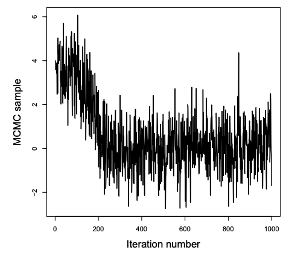
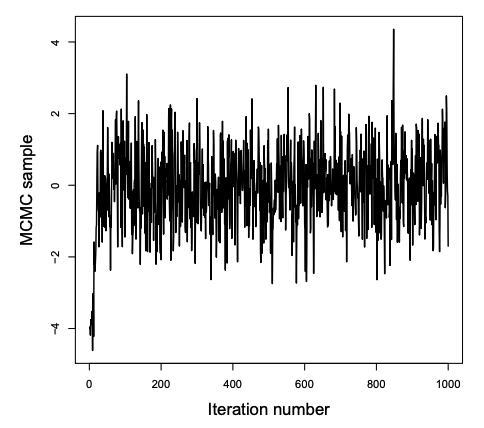
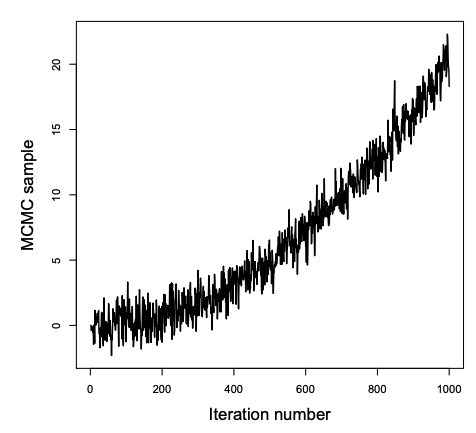
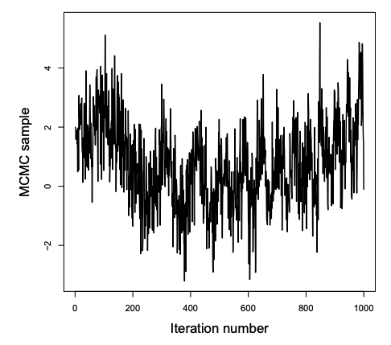

---
header-includes:
   - \usepackage{multicol}
output:
  pdf_document: default
  html_document: default
---

```{r setup, include=FALSE, cache=TRUE}
knitr::opts_chunk$set(echo = TRUE)
```

# The Gibbs sampler
## Stat 340, Fall 2021


## Your turn

For each of the following trace plots, determine

1. whether the chain converged, and

2. roughly how many iterations it took to converge.

\begin{multicols}{2}

```{r echo=FALSE, out.width="0.5\\textwidth"}

```

```{r echo=FALSE, out.width="0.5\\textwidth"}

```

```{r echo=FALSE, out.width="0.5\\textwidth"}

```

```{r echo=FALSE, out.width="0.5\\textwidth"}

```
\end{multicols}


## Example: Change in voting patterns 2016 to 2020

As a first example using the Gibbs sampler, we'll revisit the differences in voting patterns between the 2016 and 2020 presidential elections. Recall that we explored the percent change in the democratic two-party vote and assumed that $\sigma$ was known. That is unrealistic, so today we'll consider the case where both $\mu$ and $\sigma$ are unknown.


### Data import and wrangling

You can load the full data set using the below code and pull off the `pct_change_dem` column using the below code chunk:

```{r message=FALSE}
library(readr)
votes <- read_csv("https://aloy.github.io/stat340-notes-fa21/data/pres_pct_change_2016_2020.csv")
pct_change <- votes$pct_change_dem
```

In this example, we'll consider only a random sample of size 100, which you can draw using the following code:

```{r}
set.seed(23537095)
sample_change <- sample(na.omit(pct_change), 100)
```


### The proposed model

In this example, we will use the following Normal model to analyze the percent change in democratic support:


\begin{align*}
Y_i | \mu, \sigma &\overset{\rm iid}{\sim} \mathcal{N}(\mu, \sigma) & \qquad \qquad \qquad \qquad \qquad \qquad \qquad \qquad \phantom{text}\\
\mu & \sim \mathcal{N}(\mu_0, \sqrt{1/\phi_0}) &\\
\phi = 1/\sigma^2 & \sim {\rm Gamma}(a, b) &\\
\mu &\perp \phi
\end{align*}


Notice that we are assuming the $\mu$ and $\sigma^2$ are independent. Further, we'll use the uninformative (or weakly informative) prior specification given by

$$
\mu_0 = 0, \qquad
\phi_0 = 1/1000, \qquad
a = 0.1, \qquad
b = 0.1
$$

Using this model specification, the posterior distribution is given by


\begin{align*}
\pi(\mu, \phi | y_1, \ldots, y_n) &\propto \pi(\mu) \pi(\phi) \cdot \prod_{i=1}^n f(y_i | \mu, \sigma^2)\\
  &\propto \exp \left[ - \dfrac{\phi_0}{2} (\mu - \mu_0)^2 \right] \cdot \phi^{a-1} \exp\left[ -b\phi \right] \cdot 
  \prod_{i=1}^n \phi^{1/2} \exp\left[ - \dfrac{\phi}{2}(y_i - \mu)^2 \right]
\end{align*}


### The Gibbs sampler

While we already have the tools to sample from the above posterior distribution in our toolkit, they do not scale and/or generalize well. Today, we'll focus on implementing the Gibbs sampler, which is a general way to sample from a posterior distribution from the full conditional posterior distributions. The two-parameter algorithm is given below:

**Algorithm:**

1. Set initial values for parameter values, $\boldsymbol{\theta}^{(0)} = \left(\theta^{(0)}_1, \theta^{(0)}_2 \right)$

2. Draw $\theta_1^{(1)}$ from $\pi(\theta_1 | \theta_2, y_1, \ldots, y_n)$ 

3. Draw $\theta_2^{(1)}$ from $\pi(\theta_2 | \theta_1, y_1, \ldots, y_n)$ 

4. Repeat steps 2-3 $S$ times

After convergence, draws $\left( \theta_1^{(k)}, \theta_2^{(k)} \right)$ are from the posterior distribution.


### Deriving the full conditionals

Before we can implement the Gibbs sampler, we must derive the full conditionals. (Yes, you can't avoid the algebra forever. It will simplify your Bayesian lives, so learn to like it!)

The full conditionals are derived below. Be sure to understand how to derive these on your own!


\begin{align*}
\pi(\phi | y_1, \ldots, y_n, \mu) & \propto \pi(\phi) f(y_1, \ldots, y_n | \phi, \mu)\\
& \propto \phi^{a-1} \exp\left[ -b\phi \right] \cdot \prod_{i=1}^n \phi^{1/2} \exp\left[ - \dfrac{\phi}{2}(y_i - \mu)^2 \right]\\
&= \phi^{a-1} \exp\left[ -b\phi \right] \cdot \phi^{n/2} \exp\left[ - \dfrac{\phi}{2} \sum_{i=1}^n (y_i - \mu)^2 \right]\\
&= \phi^{\left(n/2 + a \right) - 1} \exp\left[ -\phi \left\{ \frac{1}{2} \sum_{i=1}^n (y_i - \mu)^2 +b \right\} \right] 
\end{align*}

<br>

So $\phi | y_1, \ldots, y_n, \mu$ is...

<br>


\begin{align*}
\pi(\mu | \phi, y_1, \ldots, y_n) &\propto \pi(\mu)  \prod_{i=1}^n f(y_i | \mu, \sigma^2)\\
&\propto \exp \left[ - \dfrac{\phi_0}{2} (\mu - \mu_0)^2 \right]  \cdot 
  \prod_{i=1}^n \phi^{1/2} \exp\left[ - \dfrac{\phi}{2}(y_i - \mu)^2\right]\\
&= \exp \left[ - \dfrac{\phi_0}{2} (\mu - \mu_0)^2 \right]  \cdot \phi^{n/2} \exp \left[-\phi \left\{ \frac{1}{2} \sum_{i=1}^n (y_i - \mu)^2\right\}  \right]\\
&\propto \exp\left[ -\frac{\phi_0 + n\phi}{2} \left\{ \mu - \frac{\mu_0 \phi_0 + n \overline{y} \phi}{\phi_0 + n\phi} \right\}^2 \right]
\end{align*}


<br>

So $\mu | {\boldsymbol Y}, \sigma^2$ is...

<br>

## Implementing the Gibbs sampler in R

The hardest part about implementing a small Gibbs sampler is the amount of bookkeeping involved. I recommend beginning with a standard set up where you initialize the parameter values and create an empty matrix (or data frame) to store the MCMC samples.

```{r}
# Data
y <- sample_change
n <- length(y)

# Prior specification
mu0  <- 0
phi0 <- 1/1000
a    <- 0.1
b    <- 0.1

# Initial parameter values
mu <- mean(y)
s2 <- var(y)
phi <- 1 / s2

# Create empty S x p matrix for MCMC draws
S                    <- 5000
mcmc_draws           <- matrix(NA, nrow = S, ncol = 2)
colnames(mcmc_draws) <- c("mu", "phi")
```

Once you have loaded the data, initialized the parameters, and set up storage for the MCMC samples, the Gibbs sampler boils down to a for loop where you draw single samples for each parameter, conditioned on the last draw of the other parameter. Here, I sample draw $\mu^{(i)}$ before $\phi^{(i)}$, but this order is not important. Be sure to understand each element of the `for` loop.

```{r}
for(i in 1:S) {
  
  # sample from mu | s2, y
  A   <- sum(y) * phi + mu0 * phi0
  B   <- n * phi + 1 * phi0
  mu  <- rnorm(1, A/B, 1/sqrt(B))
  
  # sample from s2 | mu, y
  shape  <- n / 2 + a
  scale  <- (sum((y - mu)^2) / 2) + b
  phi    <- rgamma(1, shape, scale)
  
  # Store the draws
  mcmc_draws[i, ] <- c(mu, phi)
}

mcmc_draws <- as.data.frame(mcmc_draws)
```


I don't expect you to be able to code extremely complex samplers, but understanding how to code small versions will help you understand how they work and when they fail more deeply than relying only on automated computational routines. Next week we'll explore how to avoid always writing our own MCMC code, so don't distress if for loops have you down!


### Checking convergence

To check whether our Markov chain reached the stationary distribution, we can create trace plots to check whether they look like white noise (or fuzzy caterpillars if you prefer).

```{r echo=FALSE, fig.height = 3.5, fig.width = 9, fig.align='center', out.width="90%"}
par(mfrow = c(1,2))
plot(x = 1:S, y = mcmc_draws[,"mu"], xlab = "Iteration", ylab = "MCMC sample", type = "l", main = bquote("Traceplot: for " ~ mu))

plot(1:S, mcmc_draws[,"phi"], xlab = "Iteration", ylab = "MCMC sample", type = "l", main = bquote("Traceplot: for " ~ phi))
```

We should also make sure there isn't strong dependence by plotting the autocorrelation function (ACF). Remember, you want these plots to taper off very quickly.

```{r echo=FALSE, fig.height = 3.5, fig.width = 9, fig.align='center', out.width="90%"}
par(mfrow = c(1,2))
plot(acf(mcmc_draws[,"mu"], plot = FALSE), main = bquote("ACF plot: for " ~ mu))
plot(acf(mcmc_draws[,"phi"], plot = FALSE), main = bquote("ACF plot: for " ~ phi))
```


### Posterior analysis

If you are convinced that your Markov chain has converged to the stationary distribution, then you can toss out samples prior to convergence (this is called the *burn in* period) and draw inferences using the remaining MCMC samples just like we have all term.

```{r}
# Removing the first 100 samples
mcmc_draws <- mcmc_draws[-c(1:100),]
```