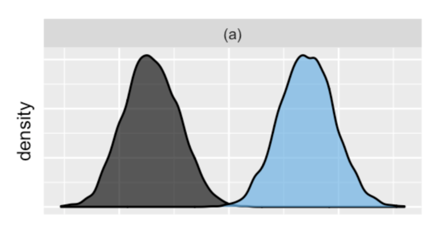

```{r setup, include=FALSE}
options(htmltools.dir.version = FALSE)
knitr::opts_chunk$set(dev = 'svg')
library(gridExtra)
library(ggplot2)
library(ggthemes)
library(LearnBayes)
library(bayesrules)
library(runjags)
library(coda)
library(bayesplot)
library(patchwork)
library(tidyverse)
library(ggridges)
library(countdown)
xaringanExtra::use_tachyons()

## School example from Hoff.
load("data/nels.Rdata")
y1 <- y.school1
y2 <- y.school2
n1 <- length(y1)
n2 <- length(y2)

school <- Y.school.mathscore %>% 
  as.data.frame %>% 
  tbl_df

## Draw a smaller sample for the first example
set.seed(9999)
sub_school <- school %>% 
  nest(data = mathscore) %>%
  slice_sample(n = 3) %>%
  unnest(cols = data)

sub_school <- sub_school %>%
  bind_rows(school %>% filter(school %in% c(67, 11))) %>%
  mutate(school = as.factor(school),
         school = fct_reorder(factor(school), .x = mathscore)
  ) %>%
  mutate(school = factor(as.numeric(school)))

y_obs <- sub_school %>%
  group_by(school) %>%
  summarize(mean = mean(mathscore))

```

class: title-slide, left, middle

# `r rmarkdown::metadata$title`

### `r rmarkdown::metadata$author`


---

## Example: ELS math scores

- 2002 Educational Longitudinal Study (ELS)

- Survey from schools across the United States

- Data are collected by sampling schools and then sampling students within each selected school

- We'll focus on 10th grade math scores from a sample of 10 schools

- Math tests contained items in arithmetic, algebra, geometry, data/probability, and advanced topics were divided into process categories of skill/knowledge, understanding/ comprehension, and problem solving

---

## ELS math scores

.left-wide[
```{r echo=FALSE, fig.height = 3, fig.width = 5, out.width="98%"}
ggplot(sub_school, aes(x = mathscore, y = school)) +
  geom_boxplot(outlier.shape = NA) +
  geom_jitter(shape = 1, height = 0.1, width = 0) +
  theme_light() +
  theme(panel.grid.major.x = element_blank(), panel.grid.minor.x = element_blank())
```
]

.right-narrow[
Possible questions:

- What’s the typical math score?

- To what extent do scores vary from school to school?

- For any single school, how much might scores vary from student to student?
]

---

## Possible analysis strategies

.bold[Complete pooling (combined estimates)]<br>
Ignore schools and lump all students together

--

.bold[No pooling (separate groups)]<br>
Separately analyze each school and assume that one school’s data doesn’t contain valuable information about another school

--

.bold[Partial pooling (compromise estimates)]<br>
Acknowledge the grouping structure, so that even though schools differ in performance, they might share valuable information about each other and about the broader population of schools

---

## What have we seen so far?

- Completely pooled model does not acknowledge differences between schools

- No pooled model acknowledges that some schools tend to score higher than others

- No pooled model ignores data on one school when learning about the typical score of another

- No pooled model cannot be generalized to schools outside our sample

---

## Hierarchical model

Let's compromise between the the complete pooled and no pooled models 

How? By using a *two-stage prior* specification

---

#### Hierarchical model specification for JAGS

.code100[
```{r}
modelString <-"model {

## sampling
for (i in 1:N){
   y[i] ~ dnorm(mu_j[school[i]], invsigma2)
}

## priors
for (j in 1:J){
   mu_j[j] ~ dnorm(mu, invtau2)
}

invsigma2 ~ dgamma(a_s, b_s)
sigma <- sqrt(pow(invsigma2, -1))

## hyperpriors
mu ~ dnorm(mu0, g0)
invtau2 ~ dgamma(a_t, b_t)
tau <- sqrt(pow(invtau2, -1))
}
"
```
]

---

#### Define the data and prior parameters


```{r}
y <- sub_school$mathscore      
school <- sub_school$school
N <- length(y)  
J <- length(unique(school)) 
the_data <- list(y = y, school = school, 
                 N = N, J = J,
                 mu0 = 50, g0 = .04,  # prior parameters
                 a_t = 1, b_t = .01,  # hyperparameters
                 a_s = 1, b_s = .01)  # hyperparameters
```

---

#### Run MCMC

```{r results='hide', message=FALSE, warning=FALSE}
posterior <- run.jags(
  modelString,
  n.chains = 1,
  data = the_data,
  monitor = c("mu", "tau", "mu_j", "sigma"),
  adapt = 1000,
  burnin = 5000,
  sample = 5000,
  silent.jags = TRUE
)
```

---

.code100[
```{r}
print(posterior, digits = 3)  
```
]

---

```{r fig.height = 7, fig.width = 12, out.width = "85%"}
mcmc_intervals(posterior$mcmc, regex_pars = "mu")
```

---

## Hierarchical predictions vs. sample means

```{r echo=FALSE, fig.height = 3, fig.width = 6, fig.align='center', out.width = "90%"}

n_yrep <- 5
nsim <- 5000
hierarchical_pp <- matrix(nrow = nsim, ncol = n_yrep)
for(i in 1:nsim) {
  draw <- posterior$mcmc[[1]][i,]
  hierarchical_pp[i,] <- rnorm(n_yrep, draw[3:7], draw[8])
}

ppc_intervals(y_obs$mean, yrep = hierarchical_pp,
              prob_outer = 0.80)

```

---
background-image: url(img/bayesrule-hierarchical-varcomp.png)
background-size: 100%
background-position: middle
## Comparing sources of variability

.flex[
.left-col[
.hidden[X]between > within
]

.middle-col[
.hidden[XX]between $\approx$ within
]

.right-col[
.hidden[XXXX]between < within
]
]

---

## Within-group (intraclass) correlation

Suppose we're in the situation where between group variability is much larger than within group variability

.pull-left[
```{r echo=FALSE}

```
]

.pull-right[
- Two observations within the same group are more similar than two observations from different groups

- Observations within the same group are correlated <br>(generally true, easier to see in this extreme case)
]

---

## Full ELS data set

```{r echo=FALSE, fig.height = 3, fig.width = 9, out.width = "100%"}
els <- Y.school.mathscore %>% 
  as.data.frame %>% 
  tbl_df

els <- els %>%
  mutate(
    school = as.factor(school),
    school = fct_reorder(factor(school), .x = mathscore)
  )

ggplot(els, aes(y = mathscore, x = school)) +
  geom_boxplot() +
  # geom_jitter(shape = 1, height = 0.1, width = 0) +
  theme_light() +
  theme(
    panel.grid.major.x = element_blank(), 
    panel.grid.minor.x = element_blank(),
    axis.text.x = element_text(angle = 90, vjust = 0.5, hjust=1, size = 6)
  )
```

- `r nlevels(els$school)` schools from urban settings in the full data set

- Sample sizes range from 4 to 32 students

```{r results='hide', message=FALSE, warning=FALSE}
full_data <- list(
  y = els$mathscore, 
  school = els$school, 
  N = nrow(els), 
  J = nlevels(els$school),
  mu0 = 50, g0 = .04,  # prior parameters
  a_t = 1, b_t = .01,  # hyperparameters
  a_s = 1, b_s = .01   # hyperparameters
)

posterior_full <- run.jags(
  modelString,
  n.chains = 1,
  data = full_data,
  monitor = c("mu", "tau", "mu_j", "sigma"),
  adapt = 1000,
  burnin = 5000,
  sample = 5000,
  silent.jags = TRUE
)

post_intervals <- mcmc_intervals_data(posterior_full$mcmc, regex_pars = "mu")

```

---

## ELS intraclass correlation


```{r}
draws <- posterior_full$mcmc[[1]]
icc <- draws[,"tau"]^2 / (draws[,"tau"]^2 + draws[,"sigma"]^2)
```

.left-wide[
```{r echo=FALSE, fig.height = 2.5, fig.width=4.5, fig.align='center', out.width="95%"}
mcmc_areas(data.frame(icc = icc)) + xlab("intraclass correlation")
```
]

.right-narrow[
90% credible interval:
```{r echo=FALSE}
round(quantile(icc, probs = c(0.05, 0.95)), 3)
```
]

---

## ELS global mean

Inference for the global parameters proceeds as always

.left-wide[
```{r echo=FALSE, fig.height = 2.5, fig.width=4.5, fig.align='center', out.width="95%"}
mcmc_areas(posterior_full$mcmc, pars = "mu")
```
]

.right-narrow[
90% credible interval:
```{r echo=FALSE}
round(quantile(posterior_full$mcmc[[1]][,"mu"], probs = c(0.05, 0.95)), 2)
```
]

---

## Inference for group-specific means

There are often *a lot* of parameters to manage for group-specific inference

```{r echo=FALSE, fig.height = 3, fig.width = 9, out.width = "100%"}
slice(post_intervals, 2:101) %>%
  ggplot(
    aes(x = reorder(parameter, m), y = m, ymin = ll, ymax = hh)) +
  geom_pointrange() +
  theme_light() +
  xaxis_text(angle = 90, size = 6) +
  theme(
    panel.grid.major.x = element_blank(), 
    panel.grid.minor.x = element_blank()
  ) +
  xlab("school") +
  ylab("mean math score")
```

---

class: inverse

## Your turn

School 3 and 17 have roughly the same posterior mean, but substantially different credible interval widths

Discuss with a neighbor why you think this difference occurs.

```{r echo=FALSE, fig.height = 3, fig.width=2}
slice(post_intervals, 2:101) %>%
  filter(parameter %in% c("mu_j[17]", "mu_j[3]")) %>%
  ggplot(
    aes(x = reorder(parameter, m), y = m, ymin = ll, ymax = hh)) +
  geom_pointrange() +
  theme_light() +
  xaxis_text(angle = 90, size = 6) +
  theme(
    panel.grid.major.x = element_blank(), 
    panel.grid.minor.x = element_blank()
  ) +
  xlab("school") +
  ylab("mean math score")
```

```{r echo=FALSE}
countdown(2)
```

---

## Prediction for observed group

Suppose we want to make a prediction for school 13, then we need a posterior predictive distribution

```{r}
# Work with a data frame
post_df <- as.data.frame(posterior_full$mcmc[[1]])

# Create the posterior predictive via simulation
pp_school13 <- post_df %>%
  select(mu_j = "mu_j[13]", sigma) %>%               # select relevant cols
  mutate(y_pred = rnorm(nrow(post_df), mu_j, sigma)) # simulate a new obs.

# Check it out
head(pp_school13, 3)
```

---

## Prediction for unobserved group

Suppose we want to make a prediction for a school we didn't observe, let's call it school 101

```{r}
# Create the posterior predictive via simulation
pp_school101 <- post_df %>%
  select(mu, tau, sigma) %>%                   # select global params
  mutate(
    mu_j = rnorm(nrow(post_df), mu, tau),      # generate mu_j
    y_pred = rnorm(nrow(post_df), mu_j, sigma) # generate y
  ) 

# Check it out
head(pp_school101, 3)
```

---

## How do the predictions compare?

```{r echo=FALSE, fig.height=5, fig.width = 9, out.width="70%"}
pp_school13$school <- 13
pp_school101$school <- 101

pp <- data.frame(
  school13 = pp_school13$y_pred,
  school101 = pp_school101$y_pred
)

mcmc_areas(pp)
```

